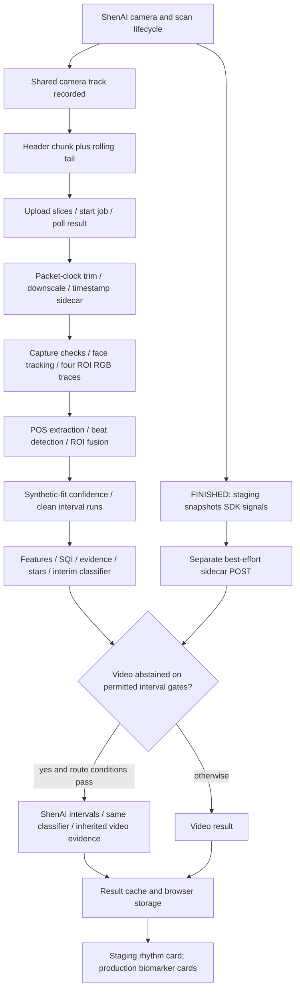

# AFib Phase 1: investigation and recommended design

Audit date: 2026-09-16. Service inspection began at `e71ce07`; replay recorded `d6ba654`. The intervening commit changes CI files only, not the analysed pipeline. Webapp checkout: `0a17167` on `staging`.

**The ShenAI capture flow can remain. The existing downstream decision and delivery design cannot yet support the requested guarantees.** There are reproducible integration failures, a decision rule that can turn greater measurement uncertainty into a negative rhythm classification, and an unvalidated transfer of evidence between the video and ShenAI interval sources. Facial-video AFib screening is technically plausible; reliability of this particular implementation has not been established.

This investigation added offline audit tools and evidence files. It did not change a clinical decision, threshold, camera setting, production response, or deployment. Phase 1 has **not** been achieved by this investigation.

## 1. Scope and evidence boundaries

The actual files, rather than historical comments, determine the findings below. Several comments still describe the ShenAI sidecar as “offline only”; the current chunked service path uses it for the live rhythm decision. Conversely, some standing notes describe missing public-data experiments that already exist in `models/`.

The evaluation corpus is absent from this checkout but was located in `/Users/ravindrasinghbisht/Downloads/cardio/data/eval_corpus`. It contains **11 paired phone recordings and ShenAI sidecars**, in addition to the legacy corpus. The filename of an older comparison says “10clips” but contains 11 records. These are diagnostic examples, not an independent clinical test set.

Public health checks during this audit returned staging build `4e0b574ff5f2`, sheet gid `342232654`, and production build `c956a4574110`, sheet gid `140358874`; both reported the documented collapsed-timestamp override of 0.05. The sheet tabs remain distinct. This checkout is a separate fork with a new deployment workflow. The local webapp environment points **both** AFib URLs to localhost:8790, so a local route comparison does not imply separate service environments. No production scan or sheet write was performed.

The retained phone clips have no simultaneous ECG rhythm labels or verified participant identifiers. They cannot establish AF sensitivity, specificity, negative predictive value, or population repeatability. SDK HR agreement measures agreement with another algorithm on the same camera input.

## 2. What the current ShenAI integration exposes

The imported package is `avatarxvitals`, declared version **2.11.6**, loaded from `avatarxvitals/index.mjs`. Staging requests a custom **50-second** measurement. Its wall-clock duration can be much longer while ShenAI waits for acceptable input. The final results, the SDK's selected physiological interval, and our recording duration must not be assumed to share one time origin.

| Information | Available in the inspected integration | What AFib receives or uses | Important qualification |
|---|---|---|---|
| Camera video | The live SDK-owned `MxVideoTrack`; MediaRecorder records the same track. Canvas capture is a fallback. | Compressed WebM/MP4, uploaded in slices. | This is camera video, not raw sensor data. Camera processing and compression have already occurred. |
| Final beat intervals | `heartbeats[]`: start seconds, end seconds, duration milliseconds. | Staging snapshots these at FINISHED. The service can substitute their start times for its own beat series. | Derived detections; the exposed type contains no per-beat quality, correction flag, or uncertainty. |
| Derived rPPG waveform | `getFullPpgSignal(): number[]`. | Staging sends a rounded sample array. The online route does **not** use it. | The type supplies no per-sample timestamps or explicit clock origin. Current documentation describes camera-rate sampling, usually 30 fps; that is not an exact time map for these stored arrays. |
| Final measurements | HR, SDNN, lnRMSSD, breathing rate, BP, stress and other estimates. | HR/SDNN/BP are comparison metadata; staging additionally sends lnRMSSD and quality. | Summary HR or HRV cannot establish an AF/non-AF label. All remain derived outputs. |
| Quality | Average signal quality, current signal-quality getter, total bad-signal seconds; quality-map image API. | Sidecar carries average quality and bad seconds. No quality time series is recorded. | Missing quality is currently optional in the train checks. Global averages do not identify which beats are unreliable. |
| Time-varying HR | 4-second and 10-second history APIs; realtime heartbeat API. | Staging snapshots the 10-second HR history; online classification does not use it. | Windowed HR is not a substitute for beat-to-beat timing. |
| Capture conditions | Our pre-check estimates delivered fps and face brightness; attempts guarded exposure/white-balance locking. | Lock states, fps, luma and a note go to the service. | This is our capture metadata, not independent physiological truth. |
| Identity and provenance | Sidecar schema version, session, upload ID, snapshot time, configured duration, recorder duration. | Paired by upload ID on the chunked path. | Constant session identifiers do not identify a participant. Actual SDK build/hash and full effective configuration are not pinned in each sidecar. |
| Newer SDK quality fields | Current public docs describe optional `quality_metrics`, including PPG quality. | Absent from the local 2.11.6 type and snapshot. | Do not assume newer APIs are available in this bundled SDK without a runtime capability check. |

Local API definitions: [index.d.ts](/Users/ravindrasinghbisht/Downloads/webapp/avatarxvitals/index.d.ts:43). Snapshot: [CardioStagingScan.jsx](/Users/ravindrasinghbisht/Downloads/webapp/src/Pages/CardioStaging/CardioStagingScan.jsx:140). Public contract: [ShenAI results documentation](https://developer.shen.ai/video-measurement/results).

ShenAI already performs proprietary face/signal processing and beat detection before these outputs appear. The inspected API does not establish how ectopic beats, AF, missed beats, interpolation, smoothing, or rejected periods are handled. A low-variability exported train could reflect physiology, processing, or both. Agreement between that train's RMSSD and the SDK's own RMSSD cannot distinguish those explanations.

## 3. The actual end-to-end path



Staging defaults to a requested 12 Mbps recording, with a URL bitrate override; production's route uses 5 Mbps. The recorder keeps the first container/header chunk and roughly the last 48 seconds, creating a hole in long captures. The processor requests 70 seconds, but cannot recover the already discarded middle. The code correctly attempts to trim using packet timestamps before downscaling; this does not restore deleted signal.

Our extractor tracks the face independently of ShenAI, forms forehead/cheek/nose traces, splits at frame gaps, applies POS by default, detects peaks, fuses at least two ROIs, calibrates confidence, and discards/splits intervals using confidence, duration and local-ratio rules. `coverage` uses retained analysable capture segments as its denominator, not necessarily the whole scan. The classifier is **`interim_rules`**, not Model A. It emits ACCEPT with SINUS / AFIB_SUGGESTIVE / OTHER_IRREGULAR / HIGH_RATE, or abstains as REPEAT_SCAN / NO_RESULT.

The ShenAI route runs only after the video result, only on the chunked path, and only after selected video gates failed. It checks train duration/count, optional SDK quality and RMSSD consistency, and approximate agreement with our estimated rate. It then reuses the video path's coherence, timing and confidence. The two clocks are not aligned to a verified common interval. It does not evaluate an alternative train when the video already accepted.

Service entry points: [measure_api.py](/Users/ravindrasinghbisht/Downloads/avatarx-cardio-codex/app/measure_api.py:599), [pipeline.py](/Users/ravindrasinghbisht/Downloads/avatarx-cardio-codex/inference/pipeline.py:86), [shenai_route.py](/Users/ravindrasinghbisht/Downloads/avatarx-cardio-codex/inference/shenai_route.py:245).

## 4. Confirmed causes and defects

| Priority | Finding and evidence | Consequence |
|---|---|---|
| P0 | With identical rhythm features (median absolute successive difference 65 ms, pNN50 0.50), changing timing precision from 20 to 30 ms changes ACCEPT/AFIB_SUGGESTIVE to ACCEPT/SINUS. Reproduced against the current classifier. | Greater measurement uncertainty can produce a negative-looking result. “AF not established” is being treated as “regular rhythm established.” |
| P0 | A video with 8 clean intervals is capped at two stars. The fallback inherits these stars even after replacing the interval source. A constructed regular train is accepted; an AF-like train is refused solely by the inherited three-star AF floor. | The new source can recover a regular classification without recovering equivalent ability to detect AF. Existing tests use a manually assigned three-star fixture that a count-limited production video cannot produce. |
| P0 | `_settle` writes a shared route key without validating an active scan ID. The audit settled new scan B, then old scan A; storage changed from B to A. | A late earlier result can be presented for a newer scan. Per-upload server caching does not prevent the client-side race. |
| P1 | Production results render biomarker cards but no AFib rhythm card. Staging has several rhythm labels, not the requested three outcomes. Error envelopes have no rhythm result. | “The service answered” and “the user received an AFib result” are different events. |
| P1 | `enabled:false` removes AFib from the orchestrator. Missing URL, kill switch, unsupported recording, or recorder failure can omit analysis; caught lifecycle exceptions can leave missing keys. | A successful ShenAI completion does not guarantee AFib execution. The disabled-processor probe returns `{}`. |
| P1 | `/api/start` consumes parts before returning 202. A lost acknowledgement followed by the same request returns 400 “no parts received,” although a job was submitted. | The client can fail a successfully started analysis and skip result recovery and sidecar delivery. Start needs idempotency. |
| P1 | Slice/start/result fetches have no per-request deadline. Single-shot code clears its timer before reading the response body. Recorder finish waits for `onstop` without a watchdog. | Finite retry counts do not guarantee completion when a promise never settles. The UI's 300-second polling limit can expire while work continues. |
| P1 | The sidecar is best effort, one attempt, posted after start. Single-shot fallback posts it only after receiving the answer, and `_run` does not invoke the ShenAI route. | Identical physiological input can follow different algorithms because of a transport fallback or arrival timing. |
| P1 | Results and job state live in process memory; the browser's pending upload ID is not a durable per-scan ledger. | Restart, reload, worker routing, eviction or TTL expiry can make finished work unrecoverable. |
| P1 | Timing matching permits multiple beats in one ROI to reuse a beat in another. A constructed example reports matched fraction **1.1667**. | Timing evidence is not a valid one-to-one agreement measure and can overstate support. |
| P1 | `shenaiNum(null)` evaluates to **0**. This occurs in the snapshot helper for nullable metrics and beat fields; waveform conversion uses the same numeric coercion pattern. | Explicit missingness can become fabricated zero data. In particular, zero lnRMSSD becomes a nonzero derived RMSSD in the service. |
| P1 | A used ShenAI route updates top-level outcome and debug rationale, but leaves `head_results` from the video decision. Confirmed in a real replay: top-level ACCEPT/SINUS, AFib head REPEAT_SCAN. | One response can contain contradictory AFib answers. |
| P1 | `train_checks` accepts absent SDK quality, bad-signal and reference-RMSSD fields; train beat confidence is synthesized as 1.0. | Absence of per-source evidence is not distinguished sufficiently from verified evidence. These values are placeholders, not calibrated confidence. |

Source anchors: [noise rule](/Users/ravindrasinghbisht/Downloads/avatarx-cardio-codex/inference/decision_logic.py:386), [timing matcher](/Users/ravindrasinghbisht/Downloads/avatarx-cardio-codex/inference/decision_logic.py:130), [star ceiling](/Users/ravindrasinghbisht/Downloads/avatarx-cardio-codex/inference/confidence_stars.py:98), [source substitution](/Users/ravindrasinghbisht/Downloads/avatarx-cardio-codex/inference/shenai_route.py:350), [start handler](/Users/ravindrasinghbisht/Downloads/avatarx-cardio-codex/app/measure_api.py:1451), [client settlement](/Users/ravindrasinghbisht/Downloads/webapp/src/lib/scan/staging/AFibProcessor.js:783).

These are code/probe findings. Their frequency in real use has not been measured by this audit. A constructed AF-like interval train is not an ECG-confirmed AF patient.

## 5. Signal and model assumptions that still need evidence

* **Cross-ROI agreement is not independence.** All face regions share camera timing, lighting, motion and compression. The “coherence” implementation is fused-beat ROI membership, not an independent physiological reference. Common errors can agree. The noise-floor calculation's Gaussian/independent-error and averaging assumptions require validation; a best-pair timing statistic is not automatically the uncertainty of fused beats or SDK beats.
* **The cleaner can remove real irregularity.** Missed-beat ratios, short-pair rules and refractory periods can reject true AF or ectopic intervals. Keeping a train smooth is not the objective. Preserve original detections, attach artifact probabilities and audit exclusions against ECG/contact PPG.
* **Capture quality can be confused with extractor failure.** A sparse POS lattice does not prove the camera contained insufficient physiological information. Conversely, a dense SDK train does not prove accurate beat timing. Each source needs its own evaluation.
* **The clocks and windows differ.** Frame-gap splitting, discarded sub-three-second segments, rolling-tail encoding, timestamp repair and whole-SDK vs video-tail selection affect what is observed. Comparing unaligned summary rates does not verify the same beat sequence.
* **Confidence is not clinical probability.** Default beat confidence was fitted on synthetic 60-fps pulse examples. Stars are hand-weighted evidence margins. Neither is a calibrated probability that AF is present or absent in phone users.
* **There is an existing alternative model, but it is not ready to switch on.** `model_a_v01.json` is a logistic model fitted on synthetically degraded real MIMIC PERform RR data. The stored moderate-degradation report covers 35 participants / 455 windows and reports AUROC 0.983. This is an archived RR simulation result, not a new result from this audit, not ShenAI validation, and not facial-video performance. Its 90-second training windows also differ from today's retained phone windows.
* **Current optimization metrics target the wrong endpoint.** Card availability, card-value CV and HR agreement cannot establish AFib performance. Legacy replay bypasses the sidecar route, and its determinism comparison does not check `predicted_class`. Sheet pairing by User-Agent does not identify a person. Preserve existing regression gates, but add a separately preregistered AFib evaluation; do not call card improvements AF accuracy.

## 6. What external evidence supports

Facial-video AFib screening has demonstrated feasibility. In Yan et al.'s 217-inpatient study, the facial method reported 94.7% sensitivity and 95.8% specificity against ECG. Its protocol used three 20-second readings, and its positive rule included three uninterpretable readings. **That latter rule is incompatible with this request and must not be copied.** Ectopy and bradycardia contributed false positives. This supports testing facial screening with real competing rhythms, not importing the reported performance. [Primary study](https://pmc.ncbi.nlm.nih.gov/articles/PMC6015414/).

Sun et al. trained a video extractor specifically on systolic-peak timing, then used interval features and an SVM. The study recorded 100 healthy subjects and 100 AF patients and used subject-independent cross-validation. The relevant lesson is to optimize timing fidelity for rhythm classification rather than average HR alone; those results do not validate this SDK or camera flow. [Peer-reviewed study](https://pubmed.ncbi.nlm.nih.gov/35867368/).

The open **MIMIC PERform AF** set provides 20-minute contact PPG/ECG recordings from 35 critically ill adults, 19 AF and 16 non-AF, at 125 Hz. It is useful for comparing beat detectors and rhythm classifiers and checking whether artifact handling suppresses AF. It does not contain facial video or ShenAI output and cannot close that domain gap. [Dataset authors' documentation](https://ppg-beats.readthedocs.io/en/latest/datasets/mimic_perform_af/).

**PPG-beats** supplies reproducible detector benchmarks. **rPPG-Toolbox** supplies classical and learned video extractors such as POS, CHROM, PhysNet and PhysFormer; use them as candidates under one timing/rhythm benchmark, not as proof that a newer network is better for AF. **SiamAF** is a relevant waveform-model research comparator, but its documented training is bedside contact PPG/ECG; direct use on an undocumented SDK waveform would be an unvalidated domain transfer. [PPG-beats](https://ppg-beats.readthedocs.io/en/latest/tutorials/designing_beat_detector/), [rPPG-Toolbox](https://github.com/ubicomplab/rPPG-Toolbox), [SiamAF model card](https://github.com/chengstark/SiamAF/blob/master/model_card.md).

ShenAI's published Medical SDK scope lists HR, SDNN, breathing rate and BP. That does not establish AF discrimination or preservation of AF timing in this application's exported beat train. [Vendor's stated scope](https://shen.ai/blog/a-practical-introduction-to-the-shen-ai-medical-sdk).

## 7. Recommended Phase 1 design

### A. Make every scan a traceable analysis transaction

Create a unique `scan_id` **before capture**, carried through the SDK snapshot, recording, uploads, job, response, browser state and telemetry. Store results by scan ID; only render the result for the explicitly selected scan. Freeze an immutable input manifest with hashes, source availability and capture/version metadata.

Register all completed SDK scans with the AFib coordinator, even when configuration or recording failed. Make create/upload/start/collect idempotent. Persist accepted work and terminal results across process restarts; add bounded request/body/recorder deadlines and resumable uploads. A retry retrieves the result for the same immutable scan—it never reuses another scan's classification. Make all transport paths call one analysis entry point with the same inputs.

The SDK snapshot should become an acknowledged part of the input transaction, not an optional fire-and-forget attachment after analysis starts. Retention for research remains a separate policy from the transient input needed to finish a scan.

### B. Use source-specific physiological evidence

Evaluate two independently implemented *sources*, while recognizing their common camera origin: the SDK beat stream and an owned video extraction path. Each source supplies its actual interval boundaries, missingness, quality over time and calibrated timing/error estimates. Do not transfer video timing or stars onto SDK beats. Do not average their beat times without verified alignment.

Benchmark source selection or late fusion on development participants, then freeze it. A source should not win merely because it is smoother, agrees with its own HR, or arrived first. Source disagreement is information that must be explained; one faulty extractor should not automatically veto a demonstrably valid other source. Shared camera artifacts require explicit checks.

### C. Require evidence for both positive and negative decisions

Build a calibrated AF-vs-non-AF classifier from ECG-labelled physiological data that includes sinus rhythm, respiratory variability, ectopy and other relevant competing rhythms. Start with a transparent interval-feature baseline and compare it with waveform/learned alternatives. Include signal uncertainty and artifact burden without turning low quality into evidence of non-AF.

Use a preregistered indeterminate region and per-source usability criteria selected on development data. A positive requires validated AF evidence; a negative requires validated non-AF evidence over enough interpretable time. Ambiguous irregularity remains Inconclusive. There must be no default fallthrough from an unrecognized class to a reassuring sentence.

Use multiple prespecified windows **within the current scan** to evaluate persistence, disagreement and confidence. Retain evidence of genuine rhythm transitions; do not blindly majority-vote them away. Account for overlapping windows' dependence. Previous scans and user identity must not be inputs to the classifier.

### D. Preserve timing at acquisition

Keep the ShenAI-facing scan experience. Record the exact supported track/SDK versions, delivered frame times and recording segments. Prefer continuous evidence capture or independently decodable segments over header-plus-tail splicing; assess memory, upload time and SDK interference on actual phones. Keep the brightness guard on any exposure change.

Choose duration using AF sensitivity, decision yield and repeatability, comparing prespecified windows such as 30/60/90 seconds on development data. These are experimental arms, **not new production thresholds**. Completing a 50-second SDK measurement must not silently imply 50 seconds of usable evidence in our 48-second rolling recorder.

### E. One public result, explicit operational state

Add an `afib_screening` object without renaming/removing the existing response contract. On a completed analysis it has exactly one of:

| Public result | Required support |
|---|---|
| **AFib Detected** | AF pattern supported under the validated decision policy; a screening finding, with the observed interval specified. |
| **AFib Not Detected** | Adequate evidence supports non-AF during the analysed interval; not inferred from absent/failed positive evidence. |
| **Inconclusive** | A physiological ambiguity or genuinely insufficient captured physiological evidence, with a clear reason. |

Include structured reason codes, a plain-language explanation, source provenance, usable duration, versions and diagnostics. Keep operational `analysis_state` separate: captured, uploading, queued, analysing, complete, retrying or failed. Pending is not a fourth AF classification.

**A network error, disabled processor or software exception must not be relabelled physiological Inconclusive.** Under this request it is a completion defect to recover and count, not a valid screening result. Absolute completion through permanent offline operation would require a separately validated on-device analysis path and durable local input; a remote-only service cannot promise that by changing an enum. The acceptance denominator remains every successful SDK scan, so technical failures cannot be hidden by redefining “successful.”

Do not map legacy SINUS to the new negative label until its support is corrected and validated. OTHER_IRREGULAR and HIGH_RATE are not, by themselves, AF-negative evidence. Ensure the public field and every legacy AFib representation agree or are explicitly marked as source-specific diagnostics.

## 8. Validation needed to choose the strongest implementation

| Layer | Required evidence and metric |
|---|---|
| Delivery | 100% of successful SDK scans registered; every registered scan accounted for; exactly one canonical terminal screening result per completed analysis; technical failures separately counted. Fault-inject lost acknowledgements, duplicates, network stalls, restart, reload, late sidecars and overlapping scans. |
| Determinism | Same immutable input/configuration produces the same source choice, class, reasons and evidence in repeats. Compare classes, not just ACCEPT. Exclude processing duration from equality. |
| Beat fidelity | Against simultaneous ECG plus contact PPG where possible: one-to-one beat matching, interval error, missed/extra beats, coverage, and error distributions separately for AF/non-AF/ectopy. Account for pulse-transit effects; never use ECG-matched-only intervals to hide production errors. |
| AF discrimination | Patient-disjoint development/calibration/test sets and external device/site validation. Report sensitivity, specificity, precision at target prevalence, calibration and uncertainty intervals; report inconclusive and technical failure rates separately for AF and non-AF. |
| Independent repeatability | Two or more scans 10–20 minutes apart under comparable conditions, with pseudonymous participant and session IDs and simultaneous reference rhythm for each. Report the full 3×3 transition matrix, direct positive↔negative flips, conclusive-pair agreement, and inconclusive transitions with participant-cluster confidence intervals. Never credit an always-inconclusive system as stable. |
| Robustness | Prespecified lighting, motion, camera, skin-tone, age and rhythm subgroups. Test small crop/window-boundary/codec perturbations that preserve underlying physiology; separately test true rhythm changes. Hold all variants of one participant/session out together. |
| Feasibility | End-to-end p50/p95 latency, payload size, device memory/thermal impact, completion failure rate, and source availability. Benchmark with realistic network conditions. |

The existing clips can expose engineering defects and regression, but cannot be tuned into an unseen-person AF benchmark. Public ECG/contact-PPG data support component testing; **simultaneous facial video + ShenAI outputs + ECG on multiple people, including AF and confounders, is the missing decisive dataset**. A small pilot establishes feasibility and variance for sample-size planning; it is not the final validation study.

Numerical clinical and repeatability release targets should be specified before collecting/evaluating the locked test set, with the intended population and false-positive/false-negative costs. The old “80% card availability / HR agreement” target is not an AFib success criterion. Existing guardrails remain regression checks; add the AF-specific evaluation rather than weakening a gate to obtain more answers.

## 9. Concrete implementation order and decision points

1. **Delivery and identity correctness:** canonical scan ID, immutable snapshot with null preservation, mandatory AFib dispatch, idempotent start, bounded waits, recovery and one result store. Test transport faults without changing physiology.
2. **Evidence correctness:** one-to-one timing matches, source-specific confidence, consistent response representations, complete source metadata and clock provenance. Exercise both positive and negative paths; replay every retained clip and preserve all originals.
3. **AF-specific benchmark:** freeze participant splits, definitions and metrics; add public physiological comparators and collect the synchronized pilot. Establish current AF performance before selecting a replacement.
4. **Decision redesign:** compare corrected transparent rules, calibrated interval model and appropriate waveform/peak-timing models. Evaluate quality and ambiguity symmetrically. Changes to each protected decision threshold remain explicit, separate proposals supported by the benchmark.
5. **Staging prospective test:** independent repeated scans, realistic devices/network, and reference rhythm. Only promote a frozen candidate after completion, discrimination, repeatability and subgroup criteria pass.

First vendor questions to resolve: exact waveform timestamps/origin and pause behavior; whether exported intervals are rejected, corrected or interpolated; access to per-beat quality/uncertainty and raw intervals; AF/ectopy cohorts and timing error in this SDK build; reproducibility and versioning of its effective configuration. These are prepared research questions, not messages sent to the vendor.

If the SDK preserves reliable irregular beats, it is a strong candidate interval source while retaining the current capture flow. If it suppresses/reconstructs them, use the same camera flow with an owned, independently validated extractor. If the camera evidence itself cannot support timing on the intended devices/conditions, require improved acquisition or a reference sensor instead of manufacturing a negative result.

## 10. Reproduction and fresh results

**Fresh replay: 11 clips × 2 repeats = 22/22 structured returns; 11/11 identical repeated decisions; every source video, sidecar and available timestamp file unchanged by SHA-256.** The video path alone returned 0 accepted, 8 REPEAT_SCAN and 3 NO_RESULT. With the locally supplied ShenAI sidecar, 4/11 returned ACCEPT/SINUS, 4 REPEAT_SCAN and 3 NO_RESULT. All four accepted results retained two stars, and all four disagreed with the stale AFib entry in `head_results`.

| Retained clip time (UTC) | Video clean intervals | Video coverage | Final outcome | Route explanation |
|---|---:|---:|---|---|
| 08:07:12 | 4 | 0.328 | NO_RESULT | SQI and timing gates block the route. |
| 08:12:55 | 13 | 0.368 | ACCEPT/SINUS | ShenAI: 51 clean intervals, coverage 0.94. |
| 08:53:27 | 7 | 0.150 | REPEAT_SCAN | Rate corroboration fails. |
| 10:09:13 | 9 | 0.572 | REPEAT_SCAN | Rate corroboration fails. |
| 10:12:45 | 11 | 0.383 | ACCEPT/SINUS | ShenAI: 57 clean intervals, coverage 0.98. |
| 11:33:55 | 4 | 0.292 | NO_RESULT | Rate corroboration fails. |
| 11:42:37 | 5 | 0.181 | REPEAT_SCAN | Rate corroboration fails. |
| 11:45:55 | 0 | 0.000 | NO_RESULT | Video timing gate blocks the route. |
| 11:50:45 | 13 | 0.348 | ACCEPT/SINUS | ShenAI: 50 clean intervals, coverage 0.94. |
| 12:37:37 | 15 | 0.387 | ACCEPT/SINUS | ShenAI: 57 clean intervals, coverage 0.95. |
| 12:45:23 | 18 | 0.502 | REPEAT_SCAN | Rate corroboration fails. |

This used a 70-second requested window, `640x480` analysis box, consumer profile and the documented 0.05 collapsed-timestamp override. Actual retained windows were shorter. Median first-run reported server job time was 26.77 seconds on this machine, excluding network delivery and the route's online sidecar wait. This is a diagnostic baseline, not an accepted optimizer iteration or a deployment benchmark. No threshold or candidate was tuned against these clips.

The 4/11 acceptance rate is not clinical accuracy, and the 11/11 repeat equality is not human test-retest stability. No AF sensitivity can be estimated from these unlabelled phone scans. Detailed values and reasons are in [summary.json](/Users/ravindrasinghbisht/Downloads/avatarx-cardio-codex/docs/audits/afib-phase1-2026-09-16/summary.json).

The audit tools are independent of the production service. They copy videos to temporary directories and verify source SHA-256 hashes afterward. The deterministic sidecar is supplied locally, so replay cannot measure network delivery or late-arrival behavior.

```sh
/Users/ravindrasinghbisht/miniconda3/bin/python3 scripts/audit_afib_phase1.py \
  --corpus /Users/ravindrasinghbisht/Downloads/cardio/data/eval_corpus \
  --repeat 2 --out docs/audits/afib-phase1-2026-09-16/replay.json

node scripts/audit_afib_webapp.cjs /Users/ravindrasinghbisht/Downloads/webapp

/Users/ravindrasinghbisht/miniconda3/bin/python3 scripts/audit_afib_contracts.py \
  docs/audits/afib-phase1-2026-09-16/service-probes.json
```

Artifacts: [replay and classifier probes](/Users/ravindrasinghbisht/Downloads/avatarx-cardio-codex/docs/audits/afib-phase1-2026-09-16/replay.json), [webapp probes](/Users/ravindrasinghbisht/Downloads/avatarx-cardio-codex/docs/audits/afib-phase1-2026-09-16/webapp-probes.json), [service probes](/Users/ravindrasinghbisht/Downloads/avatarx-cardio-codex/docs/audits/afib-phase1-2026-09-16/service-probes.json).

## 11. Verification and limits

The focused service suite returned **78 passed, 1 skipped, 1 failed** across result delivery, ShenAI routing/columns, noise-aware irregularity, confidence stars and false-positive guards. The failure is an existing test import (`tests.test_pressure_fixes` cannot be imported by the wrapper test). Running the intended AF-preservation test directly passed: **1 passed**. This distinguishes the harness failure from a failure of that synthetic preservation check; it does not establish clinical sensitivity.

Five existing webapp suites returned **61 passed**: AFibProcessor, ShenAI sidecar, snapshot ordering, rhythm-card helpers and staging isolation. They ran under a temporary Node Jest configuration because the installed environment lacks `jest-environment-jsdom`. These are software/unit checks, not rendered-browser or phone validation. The two Python audit tools passed syntax parsing; all three audit tools ran successfully. No full 54-minute service suite or prospective phone study was run.

The existing tests can pass while the new counterexamples still reproduce: they do not currently assert end-to-end scan identity, equivalent transport evidence, or source-specific positive/negative decision support. The next implementation should turn the counterexamples into regression assertions with the intended behavior, without adjusting them to match the current defect.

Exact test selections and outcomes are saved in [verification.json](/Users/ravindrasinghbisht/Downloads/avatarx-cardio-codex/docs/audits/afib-phase1-2026-09-16/verification.json). Concurrent CI/workflow and training-run metadata changes in the shared checkout were left untouched.
